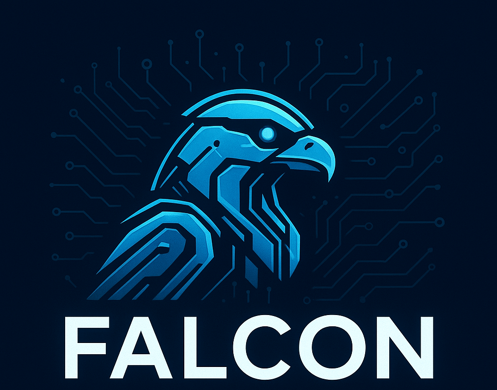

<!-- Improved compatibility of back to top link: See: https://github.com/othneildrew/Best-README-Template/pull/73 -->
<a id="readme-top"></a>
<!--
*** Thanks for checking out the Best-README-Template. If you have a suggestion
*** that would make this better, please fork the repo and create a pull request
*** or simply open an issue with the tag "enhancement".
*** Don't forget to give the project a star!
*** Thanks again! Now go create something AMAZING! :D
-->

<!-- PROJECT SHIELDS -->
<!--
*** I'm using markdown "reference style" links for readability.
*** Reference links are enclosed in brackets [ ] instead of parentheses ( ).
*** See the bottom of this document for the declaration of the reference variables
*** for contributors-url, forks-url, etc. This is an optional, concise syntax you may use.
*** https://www.markdownguide.org/basic-syntax/#reference-style-links
-->
[![Contributors][contributors-shield]][contributors-url]
[![Forks][forks-shield]][forks-url]
[![Stargazers][stars-shield]][stars-url]
[![Issues][issues-shield]][issues-url]
[![Unlicense License][license-shield]][license-url]

<!-- PROJECT LOGO -->
<br />
<div align="center">
  <a href="https://github.com/NDJSec/FALCON">
    
  </a>

  <h3 align="center">FALCON</h3>
  <h3 alight="center">Forensic AI Language Comprehensive Observable Network</h4>

  <p align="center">
    Agentic AI framework that leverages MCP servers to aid forensic engineers.
    <br />
    <a href="https://github.com/NDJSec/FALCON"><strong>Explore the docs »</strong></a>
    <br />
    <br />
    <a href="https://github.com/NDJSec/FALCON">View Demo</a>
    &middot;
    <a href="https://github.com/NDJSec/FALCON/issues/new?labels=bug&template=bug-report---.md">Report Bug</a>
    &middot;
    <a href="https://github.com/NDJSec/FALCON/issues/new?labels=enhancement&template=feature-request---.md">Request Feature</a>
  </p>
</div>


<!-- TABLE OF CONTENTS -->
<details>
  <summary>Table of Contents</summary>
  <ol>
    <li>
      <a href="#about-the-project">About The Project</a>
      <ul>
        <li><a href="#built-with">Built With</a></li>
      </ul>
    </li>
    <li>
      <a href="#getting-started">Getting Started</a>
      <ul>
        <li><a href="#prerequisites">Prerequisites</a></li>
        <li><a href="#installation">Installation</a></li>
      </ul>
    </li>
    <li><a href="#usage">Usage</a></li>
    <li>
      <a href="#grafana-setup">Grafana Setup</a>
      <ul>
        <li><a href="#prometheus-setup">Prometheus Setup</a>
        <li><a href="#postgresql-setup">PostgreSQL Seetup</a>
        <li><a href="#setup-dashboards">Setup Dashboards</a>
      </ul>
    </li>
    <li><a href="#roadmap">Roadmap</a></li>
    <li><a href="#contributing">Contributing</a></li>
    <li><a href="#license">License</a></li>
    <li><a href="#contact">Contact</a></li>
    <li><a href="#acknowledgments">Acknowledgments</a></li>
  </ol>
</details>

<!-- ABOUT THE PROJECT -->
## About The Project

[![FALCON Screen Shot][product-screenshot]]

TribeAI is an agentic framework that leverages MCP servers to provide an
external chat-based server to aid CTF particpants. Additionally, TribeAI
provides logging to gain insights into human-AI interaction.

<p align="right">(<a href="#readme-top">back to top</a>)</p>

### Built With

* Python
* FastAPI
* TypeScript
* FastMCP
* Docker
* Postgres

<p align="right">(<a href="#readme-top">back to top</a>)</p>

<!-- GETTING STARTED -->
## Getting Started

Setting up TribeAI, setup has been wrapped into Docker containers controlled with Docker Compose. While, bare-metal installation is possible, for networking ease of use. Deployment should be done with Docker.

### Prerequisites

The only required prerequsite is Docker and Docker compose. For installation of Docker compose, follow this tutorial from Docker.

* <https://docs.docker.com/compose/install/>

### Installation

1. Clone the repo

   ```sh
   git clone https://github.com/NDJSec/FALCON

   or 

   git clone git@github.com:NDJSec/FALCON.git
   ```

2. Setup environment variables
    ```bash
    cp .env.example .env

    # replace POSTGRES_PASSWORD and TOKEN_SECRET_KEY
    ```

3. Install Docker containers

    _Insure docker is running_

   ```sh
   docker-compose up --build
   ```

<p align="right">(<a href="#readme-top">back to top</a>)</p>

### Generating User Tokens

FALCON works on whitelisting tokens, where each user has their own individual token to ID them and their chats within the system. To create this token, use the following instructions.

Login into the falcon-ai container and run the following commands:

```bash
cd app

python3 token_manager.py whitelist [email]
```

<!-- USAGE EXAMPLES -->
## Usage

Use this space to show useful examples of how a project can be used. Additional screenshots, code examples and demos work well in this space. You may also link to more resources.

_For more examples, please refer to the [Documentation](https://example.com)_

<p align="right">(<a href="#readme-top">back to top</a>)</p>

<!-- ROADMAP -->
## Roadmap

* [x] UI Framework setup
* [x] API Key support
* [ ] Multi-LLM Support
  * [x] Gemini
  * [x] OpenAI
  * [ ] Ollama
* [x] MCP Support
  * [x] CyberChef
  * [ ] File Parser
  * [ ] Binwalk

See the [open issues](https://github.com/NDJSec/FALCON/issues) for a full list of proposed features (and known issues).

<p align="right">(<a href="#readme-top">back to top</a>)</p>

<!-- CONTRIBUTING -->
## Contributing

Contributions are what make the open source community such an amazing place to learn, inspire, and create. Any contributions you make are **greatly appreciated**.

If you have a suggestion that would make this better, please fork the repo and create a pull request. You can also simply open an issue with the tag "enhancement".
Don't forget to give the project a star! Thanks again!

1. Fork the Project
2. Create your Feature Branch (`git checkout -b feature/AmazingFeature`)
3. Commit your Changes (`git commit -m 'Add some AmazingFeature'`)
4. Push to the Branch (`git push origin feature/AmazingFeature`)
5. Open a Pull Request

<p align="right">(<a href="#readme-top">back to top</a>)</p>

<!-- LICENSE -->
## License

Distributed under the Unlicense License. See `LICENSE.txt` for more information.

<p align="right">(<a href="#readme-top">back to top</a>)</p>

<!-- CONTACT -->
## Contact

Nicolas Janis - [Website](https://www.nicolasjanis.dev) - <nicolas.d.janis@gmail.com>

Project Link: [https://github.com/NDJSec/FALCON](https://github.com/NDJSec/FALCON)

<p align="right">(<a href="#readme-top">back to top</a>)</p>

<!-- ACKNOWLEDGMENTS -->
## Acknowledgments

* [Img Shields](https://shields.io)
* [Font Awesome](https://fontawesome.com)
* [React Icons](https://react-icons.github.io/react-icons/search)

<p align="right">(<a href="#readme-top">back to top</a>)</p>

<!-- MARKDOWN LINKS & IMAGES -->
<!-- https://www.markdownguide.org/basic-syntax/#reference-style-links -->
[contributors-shield]: https://img.shields.io/github/contributors/NDJSec/FALCON.svg?style=for-the-badge
[contributors-url]: https://github.com/NDJSec/FALCON/graphs/contributors
[forks-shield]: https://img.shields.io/github/forks/NDJSec/FALCON.svg?style=for-the-badge
[forks-url]: https://github.com/NDJSec/FALCON/network/members
[stars-shield]: https://img.shields.io/github/stars/NDJSec/FALCON.svg?style=for-the-badge
[stars-url]: https://github.com/NDJSec/FALCON/stargazers
[issues-shield]: https://img.shields.io/github/issues/NDJSec/FALCON.svg?style=for-the-badge
[issues-url]: https://github.com/NDJSec/FALCON/issues
[license-shield]: https://img.shields.io/github/license/NDJSec/FALCON.svg?style=for-the-badge
[license-url]: https://github.com/NDJSec/FALCON/blob/master/LICENSE.txt