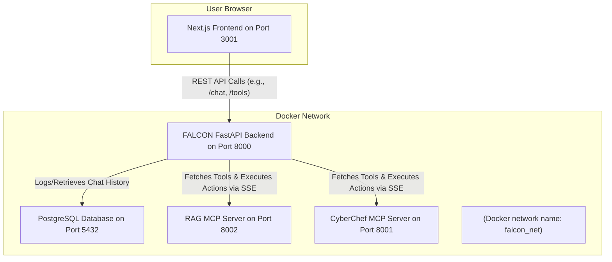

# System Architecture

The FALCON application is composed of several independent services that communicate over a Docker network. This microservices-style architecture ensures that each component is isolated and can be developed, scaled, and maintained independently.

## Core Components

- Next.js Frontend (frontend_src): A modern, responsive user interface built with React and Next.js. It provides the ChatGPT-style chat experience, manages user sessions, and communicates with the backend via REST API calls.
- FastAPI Backend (backend_src): The central nervous system of the application. Written in Python, it handles user authentication, manages chat logic, connects to the database, and interfaces with the various MCP tool servers.
- PostgreSQL Database (db): The persistent storage layer. It stores all user information, conversation histories, and individual messages.
- MCP Servers (rag_server, cyberchef_api): These are specialized, standalone servers that expose tools to the main backend. For example, the rag_server provides a tool to query a private knowledge base.
